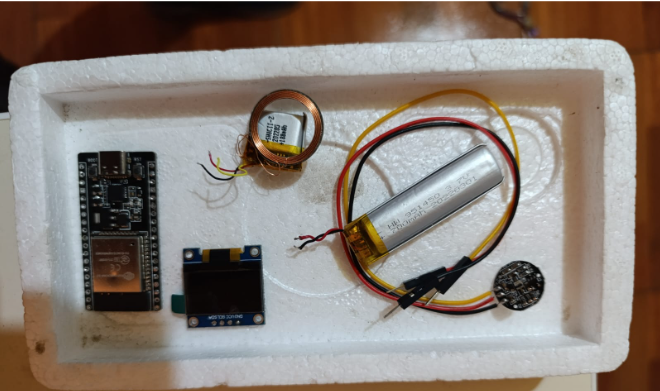
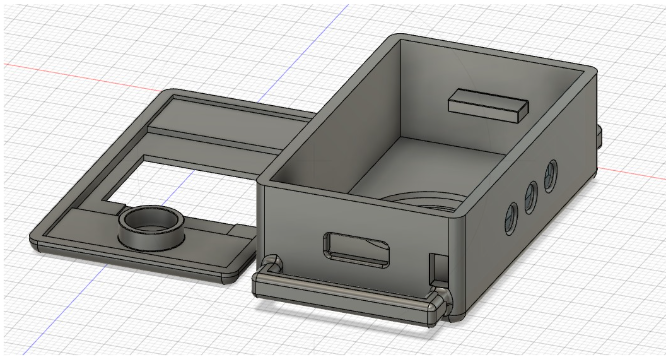
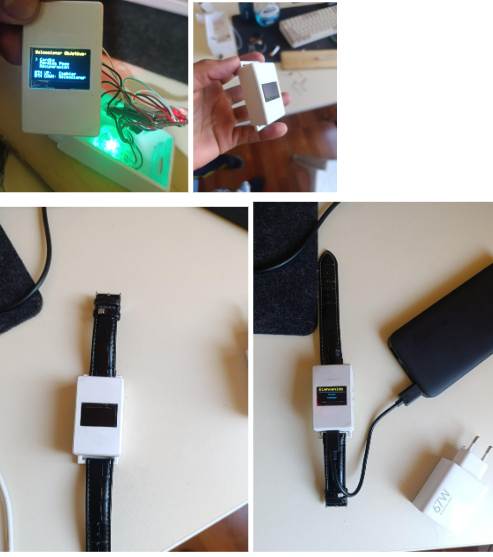

# NStrength: Wearable Biométrico con ESP32

## 📋 Descripción del Proyecto
**NStrength** es un prototipo de pulsera inteligente diseñada específicamente para deportistas y culturistas. El dispositivo utiliza sensores biométricos para optimizar la hipertrofia muscular gestionando los tiempos de descanso de forma dinámica, basándose en la recuperación cardíaca real del usuario en lugar de temporizadores fijos.

> **Nota:** Este repositorio sirve como **demostración técnica y portafolio** del desarrollo de hardware y firmware. Actualmente, el proyecto se encuentra en fase de prototipado privado y el código fuente completo no está disponible para clonación pública.

---

## 📸 Galería del Prototipo

A continuación se detalla el proceso de construcción, desde la selección de componentes hasta el ensamblaje final.

### 1. Selección de Componentes (Hardware)
Microcontrolador ESP32, pantalla OLED, sensor de pulso cardíaco, batería LiPo y sistema de carga TP4056 integrados en un diseño compacto.

### 2. Diseño y Carcasa
Modelado 3D personalizado para alojar la electrónica de forma ergonómica en la muñeca.

### 3. Integración y Circuitería (V1)
Primeras pruebas de soldadura e integración del circuito de gestión de energía y sensores en el espacio reducido.

### 4. Prototipo Funcional (V2)
Dispositivo ensamblado y funcional mostrando la interfaz de usuario en la pantalla OLED.

---

## 🛠 Stack Tecnológico

Este proyecto demuestra competencias en las siguientes áreas:

* **Microcontrolador:** ESP32 (Arquitectura Xtensa LX6).
* **Lenguaje de Firmware:** C++ (Optimizado para sistemas embebidos).
* **Hardware:**
    * Gestión de buses I2C (Pantalla OLED SSD1306).
    * Lectura analógica de precisión (Sensor de Pulso).
    * Gestión de energía (Baterías LiPo).
    * Actuadores hápticos (Motor de vibración para alertas).
* **Manufactura:** Impresión 3D y diseño CAD.

---

## ⚠️ Estado del Código y Licencia

Este proyecto es propiedad intelectual del autor. Actualmente, **no se aceptan contribuciones externas ni clonaciones** para uso comercial.

* **Desarrollador:** Milward Fernando Nina Mayta
* **Contacto:** [Tu correo o LinkedIn aquí]

---
© 2024 NStrength Project. Todos los derechos reservados.
